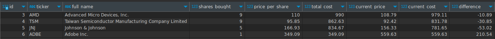

# Stocks Portfolio
#### /Python, PostgreSql, yfinance/
============================

Make a new virtual environment ('python -m venv env').

Install packages from requirements.txt ('pip install -r requirements.txt').

Make .env file and use your credentials. Connect to PostgreSQL.

Run the main.py file.

## 1. [View stock](./files/view.py)
## 2. [Add stock](./files/add.py)
## 3. [Search by ticker](./files/select_ticker.py)
## 4. [Edit stock](./files/edit.py)
## 5. [Delete stock](./files/delete.py)

